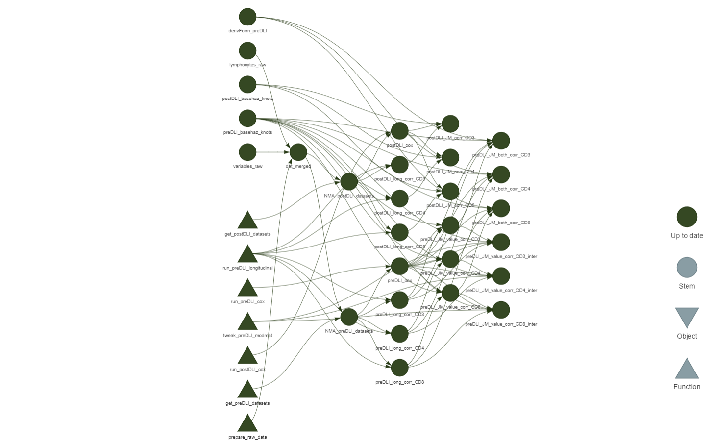

# Joint models quantify associations between immune cell kinetics and allo-immunological events after allogeneic stem cell transplantation and subsequent donor lymphocyte infusion

[](https://doi.org/10.3389/fimmu.2023.1208814)

**Authors**: Eva A. S. Koster, Edouard F. Bonneville, Peter A. von dem Borne, Peter van Balen, Erik W. A. Marijt, Jennifer M. L. Tjon, Tjeerd J. F. Snijders, Daniëlle van Lammeren, Hendrik Veelken, Hein Putter, J. H. Frederik Falkenburg, Constantijn J. M. Halkes, Liesbeth C. de Wreede

## Abstract

Alloreactive donor-derived T-cells play a pivotal role in alloimmune responses after allogeneic hematopoietic stem cell transplantation (alloSCT); both in the relapse-preventing Graft-versus-Leukemia (GvL) effect and the potentially lethal complication Graft-versus-Host-Disease (GvHD). The balance between GvL and GvHD can be shifted by removing T-cells via T-cell depletion (TCD) to reduce the risk of GvHD, and by introducing additional donor T-cells (donor lymphocyte infusions [DLI]) to boost the GvL effect. However, the association between T-cell kinetics and the occurrence of allo-immunological events has not been clearly demonstrated yet. Therefore, we investigated the complex associations between the T-cell kinetics and alloimmune responses in a cohort of 166 acute leukemia patients receiving alemtuzumab-based TCD alloSCT. Of these patients, 62 with an anticipated high risk of relapse were scheduled to receive a prophylactic DLI at 3 months after transplant. In this setting, we applied joint modelling which allowed us to better capture the complex interplay between DLI, T-cell kinetics, GvHD and relapse than traditional statistical methods. We demonstrate that DLI can induce detectable T-cell expansion, leading to an increase in total, CD4+ and CD8+ T-cell counts starting at 3 months after alloSCT. CD4+ T-cells showed the strongest association with the development of alloimmune responses: higher CD4 counts increased the risk of GvHD (hazard ratio 2.44, 95% confidence interval 1.45-4.12) and decreased the risk of relapse (hazard ratio 0.65, 95% confidence interval 0.45-0.92). Similar models showed that natural killer cells recovered rapidly after alloSCT and were associated with a lower risk of relapse (HR 0.62, 95%-CI 0.41-0.93). The results of this study advocate the use of joint models to further study immune cell kinetics in different settings.

## Usage

The analyses for this article are structured using the [`{targets}`](https://github.com/ropensci/targets) R package. Code for the individual targets are in the [_targets.md](./_targets.md) file.



Given the data, reproduce the analysis using

``` r
targets::tar_make()
```

or otherwise use parallel computation with

``` r
targets::tar_make_future(workers = future::availableCores())
```
